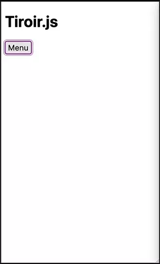

# Tiroir.js

A simple but complete drawer menu plugin in vanilla JavaScript

*⚠️ (Still in early development state)*



## Documentation

### Installation

Method                     | Procedure
-------------------------- | ---------
NPM                        | *coming soon*
Download                   | [Download zip](https://github.com/agence-webup/tiroir/archive/main.zip)

Then Tiroir have some css you will have to add (feel free to custom it for a better integration in your UI):

```html
<link rel="stylesheet" href="dist/tiroir/tiroir.css">
```

Finally just link the Tiroir's code at the end of your document:

```html
<!-- Browser build -->
<script src="dist/tiroir/tiroir.min.js"></script>
```

Or as a JS module:
```js
// ES6 module build
import tiroir from 'Tiroir'
```

### Use

#### Create the base layout for your button
1. Create a div with a `tiroirjs` css class
2. Add a `data-tiroir-direction="left"` attribute to the div if you want the menu to slide from the left side of screen (default behavior is from the right):
3. You can also add a `data-tiroir` attribute to your div to target it.
4. Fill the said div with:
  1. An emty `<div clss="tiroirjs__overlay"></div>` element
  2. A `<div clss="tiroirjs__menu"></div>` element and put whatever your want in it, it will be the menu content

Example:
```html
<button data-tiroir-btn>Menu</button>
<div class="tiroirjs" data-tiroir="mobile-menu">
  <div class="tiroirjs__overlay"></div>
  <div class="tiroirjs__menu">
    super menu
  </div>
</div>
```

#### Instantiate your new menu
```javascript
var tiroir = new Tiroir({
  target: document.querySelector('[data-tiroir="mobile-menu"]'),
  trigger: document.querySelectorAll('[data-tiroir-btn]')
})
```

#### Add content
You can create the content by yourself or use the API to build your navigation with a JSON (cf. below)

Use this template (`<div class="tiroirjs__nav">` is needed with a similar structure, otherwise you can completely customize the content)

```html
<div class="tiroirjs" data-tiroir="mobile-menu">
  <div class="tiroirjs__overlay"></div>
  <div class="tiroirjs__menu">
    <div class="tiroirjs__nav">
      <ul>
        <li>
          <a href="https://example.com" class="a">item 1</a>
        </li>
        <li>
          item 2
          <ul>
            <li><a href="https://duckduckgo.com">item 2.1</a></li>
            <li><a href="https://duckduckgo.com">item 2.2</a></li>
          </ul>
        </li>
        <li>
          <button type="button" class="button">item 3</button>
          <ul>
            <li><a href="https://duckduckgo.com">item 3.1</a></li>
            <li><a href="https://duckduckgo.com">item 3.2</a></li>
          </ul>
        </li>
        <li>
          <a href="https://duckduckgo.com">item 4</a>
          <ul>
            <li><a href="https://duckduckgo.com">item 4.1</a></li>
            <li><a href="https://duckduckgo.com">item 4.2</a></li>
          </ul>
        </li>
      </ul>
    </div>

    <div class="tiroirjs__custom">
      Some custom content
    </div>

    <div class="tiroirjs__footer">
      <a href="https://example.com">link 1</a>
      <a href="https://example.com">link 2</a>
      <a href="https://example.com">link 3</a>
    </div>
  </div>
</div>
```

## API

You can use the API to generate content and open or close your menu with JS:

Name                      | Parameter type(s)       | Description
------------------------- | ----------------------- | ----------
setItems(items)           | JSON or JS Array        | Set a custom content (more info on the structure below)
open()                    |                         | Open your dropdown
close()                   |                         | Close your dropdown
toggle()                  |                         | Toggle your dropdown

Example:
```javascript
tiroir.setItems(navContent);
tiroir.open()
```

 ### Navigation object structure

 The navigation object given to the `setItems()` must respect this type of structure to be able to work:

 ```javascript
const menu = new Tiroir({
  target: document.querySelector('[data-tiroir="mobile-menu"]'),
  trigger: document.querySelectorAll('[data-tiroir-btn]')
})

const items = [
    {
        label: 'Home',
        link: 'https://example.com/'
    },
    {
        label: 'Blog',
        items: [
            {
                label: 'Posts',
                attributes: { // You can pass custom html attributes
                    class: 'test'
                },
                link: 'https://example.com/blog/',
                items: [
                    {
                        label: 'My super post 1',
                        link: 'https://example.com/blog/test1',
                    },
                    {
                        label: 'My super post 2',
                        link: 'https://example.com/blog/test2',
                    },
                    {
                        label: 'My super post 3',
                        link: 'https://example.com/blog/test3',
                    },
                ]
            },
            {
                label: 'Videos',
                items: [
                    {
                        label: 'My first vlog',
                        link: 'https://example.com/videos/1',
                    },
                    {
                        label: 'My presentation video',
                        link: 'https://example.com/videos/2',
                    },
                    {
                        label: 'Vlog 2',
                        link: 'https://example.com/videos/3',
                    },
                ]
            },
        ]
    },
    {
        label: 'Contact',
        link: 'https://example.com/contact'
    },
]

menu.setItems(items)

```

## Options

  Name         | Type     | Description
-------------- | -------- | -----------------------------------------
  onOpen       | function | Callback to execute when tiroir is opening
  onClose      | function | Callback to execute when tiroir is closing
  resetLabel   | string   | Custom back-home button's label in the navigation
  currentLabel | string   | Custom current prefix's label in the navigation


Example:
```javascript
onst menu = new Tiroir({
  target: document.querySelector('[data-tiroir="mobile-menu"]'),
  trigger: document.querySelectorAll('[data-tiroir-btn]'),
  resetLabel: 'Back at first',
  currentLabel: 'All the ',
  onOpen: function () {
      console.log('menu opened')
  },
  onClose: function () {
      console.log('menu closed')
  }
});
```

## Modify Tiroir.js

 1. Setup dependencies: `npm i` (or `npm ci` if you don't want to impact package-lock)
 2. Run hot-reloads server for development `npm run dev`
 3. (Build for production `npm run build`)


